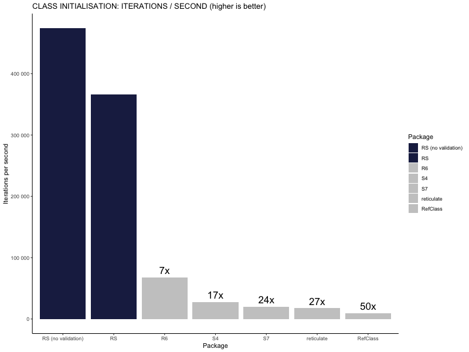

# `RS` - Fast classes for R 🔥

The name `RS` is a combination of:

- The R and S languages (S is R's predecessor).
- `.rs` - the file extension used for Rust files, and the TLD of Rust websites.

## Install

Any of the following should work:

```R
pak::pak("avhz/RS")
## or
renv::install("avhz/RS")
## or
devtools::install_github("avhz/RS")
```

## Usage

```R
Class(
    "Dog",
 
    # Fields
    name  = t_char,
    age   = t_int,
    breed = t_char,
 
    # Methods
    bark = function(.self) cat(.self@name, "goes woof!\n")
)
 
fluffy <- Dog(name = "Fluffy", age = 3L, breed = "Golden Retriever")
```

Note that the fields are special objects like `t_int`, `t_char`, etc.
These objects allow for attribute type validation.

If you pass an incorrect type for one of the fields, you will get an error like:

```R
fluffy <- Dog(name = 1, age = 3L, breed = "Golden Retriever")
"Invalid type <'double'> passed for field <'name'>."
```

```R
> fluffy@name
[1] "Fluffy"
> fluffy@age
[1] 3
> fluffy@breed
[1] "Golden Retriever"
> fluffy@bark()
Fluffy goes woof!
```

I used the slot operator `@` for accessing attributes in `RS`, because the common `$` operator
is so pervasive in R code that I wanted an operator that made
it more obvious that the object is an `RS` class,
rather than a list, dataframe, environment, R6 class, etc.

> Note:
> Inheritance is not currently supported and most likely won't be unless there is overwhelming demand for it.
> Instead, composition is supported and preferred.

## Benchmarks

The following shows the iterations per second for class instances for a number of R OOP libraries.

[](https://github.com/avhz/RS/blob/main/man/figures/bench.png)

> Note #1: the other libraries may provide more features and are currently more mature/complete offerings, in particular `R6`.

> Note #2: creating Python class instances via `reticulate` inside the R interpreter is *significantly* slower than doing it directly in Python.
> Python classes are still much, much faster than my `RS` package (~30-40x faster when I last checked).
